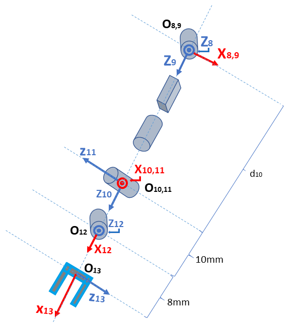
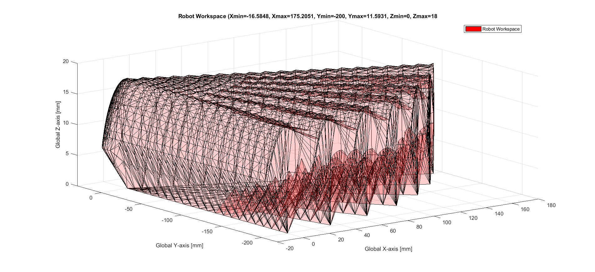
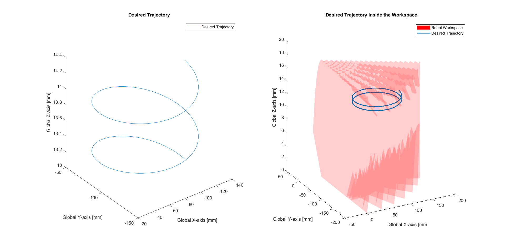
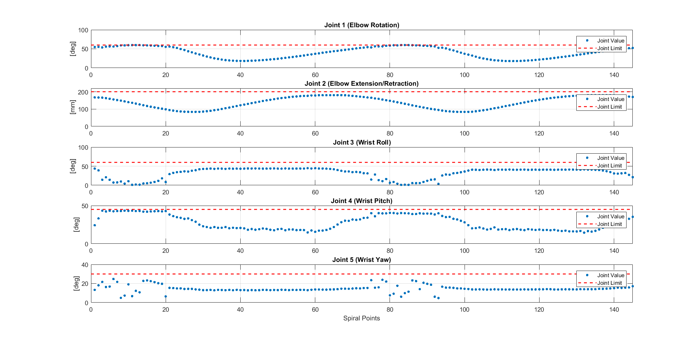
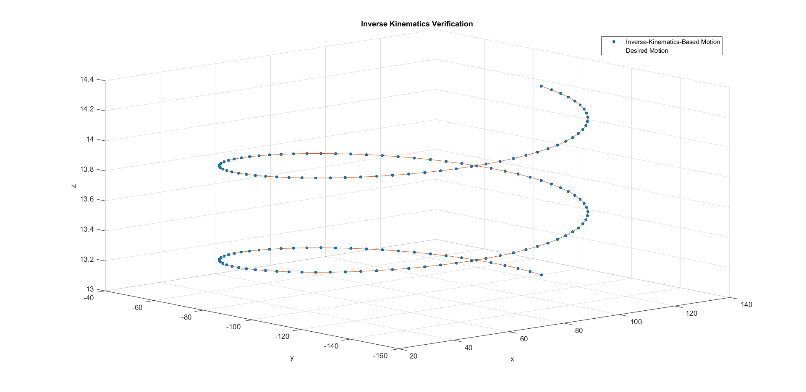
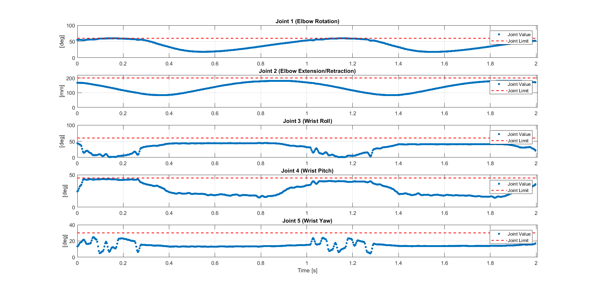
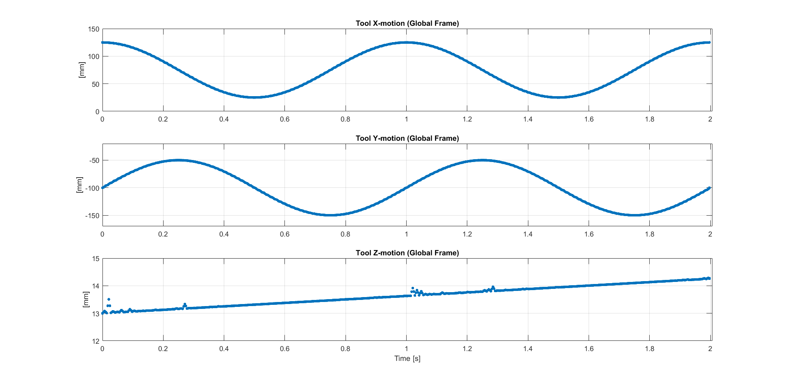

# robotic-arm
Detailed kinematics analysis of a 5-DOF robotic arm (RPRRR) without spherical wrist using nonlinear optimization for inverse kinematics subjected to joint constraints. 

The methodology and background of the methods are described in depth in the attached [report](https://github.com/pcko1/robotic-arm/blob/master/robot-arm-report.pdf).

The proposed inverse kinematics solution exhibits very promising results.

#### This project has been developed purely out of personal curiosity.

## Arm Geometry

  

## Denavit-Hartenberg parameters

|   i   |   θ    | d   |   a  | α      |
| :---: |:------:|:---:|:----:|:------:|
| 9     | θ9     | 0 mm| 0  mm|  90 deg|
| 10    | 90 deg | d10 | 0  mm|   0 deg|
| 11    | θ11    | 0 mm| 0  mm| -90 deg|
| 12    | θ12    | 0 mm| 10 mm| -90 deg|
| 13    | θ13    | 0 mm| 8  mm| -90 deg|

## Robot Workspace (under joint constraints)

  

## Desired TCP Trajectory

  

## Inverse Kinematics Solution (joint space)

  

## Inverse Kinematics Solution (world frame)

  

## Cubic Splines Interpolation in Joint Space

  

## Required Tool Trajectory

  

